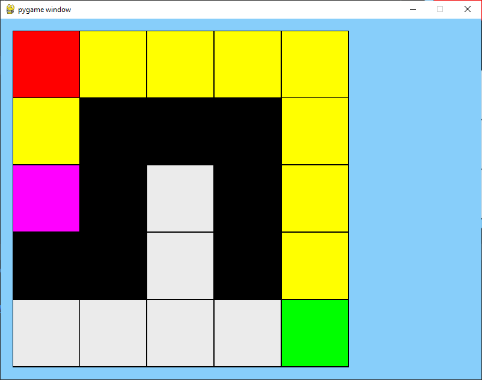
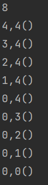

pygame demo of A* pathfind algorithm

legend:

red - start  
green - goal  
white - space  
black - wall  
yellow - possible path  
pink - dead end  
gradient - shortest path 
purple - current closest 

after reaching the goal path is printed in console:

## to launch (on python 3.10):
<li> install pygame with pip install pygame 
<li> go to display.py and run it
<li> lmd to place wall
<li> rmd to erase wall
<li> return to one-step A* pathfind algorithm

